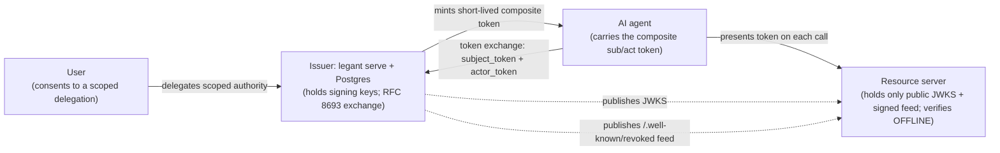

# Legant Concepts

The mental model and vocabulary behind Legant, in one place, so the how-to docs read with the terms already in hand.

Legant issues, attenuates, and audits delegated authority for AI agents. An agent acts on behalf of a human with authority you can scope, time-box, revoke, and audit. The pieces below are the words for how that works.

## Glossary

### Composite sub/act token

The token Legant mints is a single RS256-signed JWT that names two parties. `sub` is the human the agent acts for. `act` is the agent chain doing the acting (`act.sub` is the leaf agent, and a nested `act.act` records its parent, so the whole user to agent to sub-agent provenance is inside the token). A resource server reads `claims.Provenance()` to learn the human behind a call (for example `user:alice -> agent:assistant`).

### On-behalf-of vs as-the-user

Legant does delegation, not impersonation. Every minted token has `sub` set to the user and a non-nil `act` chain naming the acting agent, so the token says "this agent is acting on behalf of Alice," never "this is Alice." A plain access token from an OIDC server can carry the user's identity with no record of which agent is wielding it. The `act` chain is what makes a confused-deputy audit possible: the log names the human, and it names the agent.

### Monotonic attenuation

Authority can only ever narrow as it is re-delegated down a chain. A sub-agent gets a slice of its parent's authority and can never gain a scope, category, tool, resource, or weekday the parent lacked. Over-broad scopes are rejected at delegation and lint time. Over-broad constraints (for example a child `max_amount` larger than the parent's) are not rejected: they are silently clamped to the intersection with the parent (the `Tighten` function in `internal/delegation/delegation.go`), and lint and apply still succeed. Intersecting two disjoint non-empty allow-lists yields a deny-all sentinel, never the empty (unrestricted) list, so a disjoint re-delegation restricts to nothing rather than widening to everything.

### Offline verification

A resource server verifies a token with no callback to Legant. It needs only Legant's public JWKS (and, for Tier B revocation, the signed feed). It checks RS256 signature, `kid`, `iss`, `aud`, `exp`, the presence of an `act` chain, and the full constraint set, all from the signed token alone. That is the point of a self-contained token: the resource server does not phone home on every call. Three SDKs implement identical behavior (Go in `sdk/`, TypeScript `@legant/sdk`, Python `legant_sdk`), kept in lockstep by golden conformance vectors minted by the real Go signer.

### Constraint dimensions

A grant carries a fixed set of limits, signed into the token. `scope` is the OAuth scope ceiling. `resources` is the RFC 8707 audience allow-list (empty list denies all). `tools` is the allowed tool names. `max_amount` and `categories` bound a value and its category (for example expense submissions). `time_window` is a weekday allow-list plus an inclusive minute-of-day range in a timezone. These five (`scope`, `resources`, `tools`, `max_amount` and `categories`, `time_window`) are enforced offline at the resource server. The weekday convention is `0 = Sunday ... 6 = Saturday`, and an empty weekday list means any day (`internal/grants/grants.go`, `internal/delegation/delegation.go`).

### Mint-time-only rate

`rate` is a rolling-hour cap on how many tokens a delegation may mint. It is not a token-carried constraint and there is no `rate` field in a grant's `constraints`. A rolling-hour count needs shared state that a resource server does not have, so Legant enforces it at token-exchange (mint) time, against the recorded mint history, under a per-delegation lock. A resource server never sees or checks it.

### Tiered revocation

A signed JWT is valid until it expires, so killing one early is a choice of latency against coupling. Each resource server picks a tier, and the worst case is never worse than the token's short TTL (5m by default, configurable, with no hard ceiling). Tier A (per-call) is the MCP gateway and `/oauth2/introspect`, which consult the revocation store on every request, so a revoke is immediate. Tier B (signed feed) is an offline resource server polling `GET /.well-known/revoked`, a JWS-signed snapshot of revoked-but-unexpired `jti`s signed with the same key as the JWKS, with no per-request callback; a revoke takes effect within the poll interval. Tier C (TTL backstop) is a verifier that polls nothing and is bounded only by the token expiry. The feed can only ever miss a revoke, never forge one, so a stale or unreachable feed degrades to Tier C rather than failing a valid token. See `docs/REVOCATION.md`.

## Trust-boundary architecture

The user consents. The issuer holds the signing keys and runs the RFC 8693 exchange. The agent carries the composite token. The resource server holds only the public JWKS and the signed feed, and verifies offline.

The solid edges are request-time traffic. The dotted edges are the public material the resource server pulls on a timer: the JWKS for signature verification and the signed revocation feed for Tier B. Neither is a per-request callback. The trust boundary is the issuer: only it holds secrets, and compromise of its database or key-encryption secret is full compromise. The resource server holds only public keys and can verify without reaching the issuer at request time.

## One token, minted two ways

The coding-agent guard and the issuer mint the same delegation token, just minted two ways. One path is offline: `legant apply` (or `legant mint`) writes a `.legant` setup (`key.pem`, `jwks.json`, `feed.jwt`) and signs a token per grant into `.legant/<grant>.jwt`, with no Postgres and no Docker. The other path is online: the issuer's `/oauth2/token` RFC 8693 exchange turns a user's `subject_token` plus an agent's `actor_token` into the same composite token. Both produce a `sub`/`act` JWT carrying the same constraint dimensions, and both verify identically through the same SDK. The offline path uses `iss=https://legant.local` and `kid=legant-guard-local`; the issuer uses its own issuer URL and keystore `kid`. The shape and the verification are the same.

## How Legant relates to other tools

Legant complements RBAC, SPIFFE/SPIRE, OPA, and Kyverno; it does not replace them. They answer "which workload is this, and may that workload do X." Legant answers a different question: "on whose behalf is this agent acting, and bounded how." RBAC gives an agent a role. SPIFFE/SPIRE gives a workload an identity. OPA and Kyverno gate content and admission. None of them carry "Alice delegated this agent the authority to submit travel expenses under $500 until 5pm, and any sub-agent does less" inside a token that verifies offline. Use them together: workload identity and policy gates around the workload, Legant for the on-behalf-of authority the agent carries.

Legant bounds prompt injection; it does not prevent it. If a prompt-injected agent tries an action, the token still limits it to the delegated scopes, resources, tools, amount, and time window, and a revoke shrinks the blast radius. Legant cannot stop the agent from being tricked. It limits what a tricked agent can reach.

## See also

- `docs/GETTING_STARTED.md`: install and run the first delegation.
- `docs/GRANTS.md`: the `legant.grants.yaml` schema and the constraint dimensions in full.
- `docs/AGENT_AUTHOR.md`: building an agent that does the RFC 8693 exchange.
- `docs/GATEWAY.md`: the MCP auth-gateway and per-tool delegation.
- `docs/REVOCATION.md`: the tiered revocation design in full.
- `docs/THREAT_MODEL.md`: the delegation-specific threats and mitigations.
